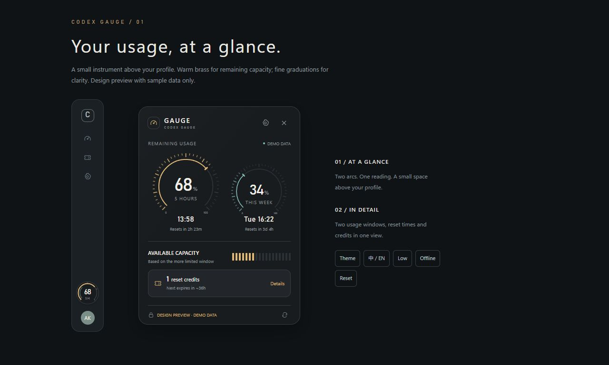

# Codex Gauge

[简体中文](README.zh-CN.md) · [Downloads](https://github.com/Akenaiai/codex-gauge/releases) · [Source](https://github.com/Akenaiai/codex-gauge)

A small, precision-styled Codex usage gauge above your profile. Hover for remaining capacity, reset times and available reset credits.



**Windows first.** Windows profile anchoring is implemented. macOS source support is an experimental floating-mode preview, not a tested equivalent of the Windows integration.

## What it does

- A 52-pixel gauge follows Codex's profile button on Windows. Hover to expand; click to keep the panel open.
- Shows the 5-hour and weekly windows actually returned by Codex. Weekly-only accounts put their weekly value first. Missing data stays unknown.
- Shows reset times, available reset credits and expiry details. Optional silent expiry reminders, deduplicated by account and credit.
- Drag to adjust position; double-click or use the tray menu to reset. Attached and floating positions are saved separately.
- Graphite, porcelain and system appearance. Complete English and Simplified Chinese interface.
- Tray access, optional start-with-Codex on Windows in installed builds, optional keep-on-top mode, manual update checks with a link to releases.
- Uses local `codex app-server` read-only RPCs. No model prompts, automatic resets, telemetry or account credential export.

## Windows installation

Download the setup executable or portable ZIP from [Releases](https://github.com/Akenaiai/codex-gauge/releases). The app is **not code-signed**. Verify the release source and SHA-256 checksum; do not disable Windows protections.

You need Windows 10/11 x64, the Codex desktop app, and an installed, signed-in [official Codex CLI](https://github.com/openai/codex). The CLI supplies authentication and current quota data. Keep Codex open for the attached gauge. If the profile cannot be located, the tray still opens the usage panel.

Normal mode hides when Codex is minimized or another app is foreground. Keep-on-top mode remains visible while Codex is minimized; both modes hide the attached gauge when Codex closes. You can still open the panel from the tray.

No extra API key is required. If CLI discovery fails, set `CODEX_GAUGE_CLI` to the **native Codex executable**, not a `.cmd` or `.ps1` wrapper. Restart Gauge after changing the environment.

### Show automatically with Codex

In the installed Windows app, enable **Settings → Start with Codex**. Version 0.1.1 registers a current-user Windows task that runs a small companion launcher independently of Codex. The helper checks for the Codex desktop window every two seconds and opens Gauge when needed. It also recovers an unexpected Gauge exit, with a 30-second retry limit. No administrator password or model calls are required.

The helper starts at Windows sign-in; a one-minute task trigger recovers the helper if it exits. Codex does not have to be running at sign-in. **Quit Codex Gauge** pauses automatic relaunch for the current Codex process; reopening Codex permits it again. Disable **Start with Codex** to remove the task. The installer stops the helper before replacement, and uninstall removes its task.

An enabled 0.1.0 login-startup preference migrates when 0.1.1 first runs. When Gauge was previously launched inside the MSIX Codex environment, the helper resolves the physical settings file and imports it only if the normal Windows profile has no settings file. Existing normal-profile settings are never overwritten. This fixes the observed case where interactive and scheduled launches saw different settings locations. The default remains off for new users.

If the gauge remains absent, open it from the desktop or Start menu and check its settings. Local `follow-status.json` in Gauge's user-data folder records only launcher state, host count and error types; it contains no account or quota information. A real Windows re-login and a future Codex update still need field verification.

## Run from Git

Install Node.js 22.12+ (a current LTS version is recommended), Git and the signed-in Codex CLI.

```sh
git clone https://github.com/Akenaiai/codex-gauge.git
cd codex-gauge
npm ci
npm start
```

Windows automatically compiles the small UI Automation observer using the system .NET Framework compiler. It only reads window geometry and the named profile control, and exits when Gauge exits.

### macOS preview

The same Git commands run the experimental floating gauge on Mac. This version does **not** yet attach above the Mac Codex profile or follow its window lifecycle. It does not request Accessibility permissions. It has not been verified on a Mac; source compatibility is not a claim of completed Mac support. CLI discovery searches PATH, common Homebrew paths and standard npm locations; use `CODEX_GAUGE_CLI` for custom installations.

On a Mac, `npm run build:mac` builds a local DMG/ZIP. No Apple signing or notarization is configured. Do not treat a Windows executable as a Mac installer. See [the Mac handoff](docs/MAC.md) for remaining work.

## Develop and verify

```sh
npm test              # data, account-switch, persistence and placement checks
npm run smoke        # real read-only quota connection; outputs capabilities only
npm run preview      # http://127.0.0.1:4387, synthetic demo data only
npm run build:win    # Windows setup executable + portable ZIP
```

`npm start -- --demo` opens an isolated native preview with sample data; it never starts Codex or sends notifications. Icons are checked in; regenerating them with `python scripts/generate-icons.py` optionally needs Pillow.

## Data and limitations

Settings and reminder deduplication records stay in the application's per-user data folder. Account identities are hashed in reminder keys. No quota history, email address, auth file, chat content or raw app-server output is saved by Gauge. Settings are written after changes; corrupt existing files are preserved and reported instead of silently overwritten.

Usage is polled once per minute while active, with bounded retry backoff. Failed reads are marked stale; passing a scheduled reset time never invents replenished quota. Reset cards are view-only.

Manual update checks contact the public GitHub release API. There is no background update checking or automatic installation in 0.1.0. The Electron runtime makes the distribution larger than the reference Tauri app. Profile anchoring depends on Codex's accessible control names and may need adjustment after a desktop update. Long-running sleep/resume, every display scale and multi-monitor configurations still need broader field testing.

## Credits and license

Functional inspiration and selected implementation rules: [returnk/codex-usage-badge](https://github.com/returnk/codex-usage-badge). See [third-party notices](THIRD_PARTY_NOTICES.md) for the exact reference and its MIT license. This project has a new instrument-style interface and an independent desktop implementation.

MIT © 2026 Aken. Built with AI assistance. Independent software; not affiliated with or endorsed by OpenAI. Support: [GitHub issues](https://github.com/Akenaiai/codex-gauge/issues) or 934026@qq.com.
