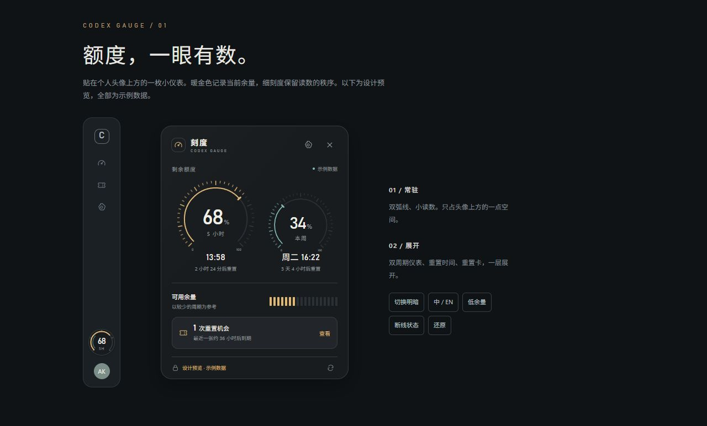

# 刻度 · Codex Gauge

[English](README.md) · [下载](https://github.com/Akenaiai/codex-gauge/releases) · [源码](https://github.com/Akenaiai/codex-gauge)

贴在 Codex 个人头像上方的一枚小仪表。悬停展开，查看剩余额度、重置时间和可用重置卡。



**先完成 Windows。** Windows 头像定位已实现；Mac 目前是源码层的自由悬浮预览，尚未实机验证，不等于 Windows 功能已全部适配。

## 功能

- 52 像素小仪表跟随 Windows Codex 头像。悬停展开，点击固定面板。
- 按实际接口显示 5 小时、本周额度。只有周额度时自动放到主位；没有返回的信息保持未知。
- 显示重置时间、重置机会及到期详情。可选静默到期通知，按账户、卡片和阶段去重。
- 拖动调整、双击归位；跟随位置和置顶位置分别保存。
- 石墨黑、瓷白、跟随系统；完整简体中文和英文界面。
- 托盘入口、安装版可选开机启动、置顶、手动检查更新及版本下载入口。
- 通过本机 `codex app-server` 只读查询；不发送模型请求，不自动使用重置卡，不上传凭据。

## Windows 安装

从[发布页](https://github.com/Akenaiai/codex-gauge/releases)下载安装程序或绿色 ZIP。当前程序**没有 Windows 代码签名**，请核对来源和 SHA-256，不关闭系统保护。

需要 Windows 10/11 x64、Codex 桌面客户端，以及已经安装并登录的[官方 Codex CLI](https://github.com/openai/codex)。CLI 提供本机登录和额度数据。打开 Codex 后，仪表会定位到个人头像上方；暂时无法定位时仍可从托盘打开详情。

普通模式在 Codex 最小化或其他应用位于前台时隐藏；置顶模式在 Codex 最小化后仍可见。Codex 关闭后两种模式都收起小仪表，托盘仍能打开详情。

无需额外 API Key。自定义 CLI 安装位置可用 `CODEX_GAUGE_CLI` 指向**原生可执行文件**，不要指向 `.cmd`、`.ps1` 启动脚本。修改后重启刻度。

## 通过 Git 运行

先安装 Node.js 22.12+（推荐当前 LTS）、Git，并登录官方 Codex CLI。

```sh
git clone https://github.com/Akenaiai/codex-gauge.git
cd codex-gauge
npm ci
npm start
```

Windows 安装依赖时会用系统 .NET Framework 编译小型窗口观察器。它只读窗口几何和已命名的头像控件，随刻度退出。

### Mac 预览与接续

同样的 Git 命令可用于 Mac 自由悬浮版源码预览。当前**尚未实现 Mac 头像吸附和跟随 Codex 开关窗口**，没有申请辅助功能权限，也尚未经过 Mac 实测。CLI 查找覆盖 PATH、常见 Homebrew 和 npm 目录；特殊安装可配置 `CODEX_GAUGE_CLI`。

在 Mac 上执行 `npm run build:mac` 可以进行本地 DMG/ZIP 构建。当前没有配置 Apple 签名、公证；Windows 安装程序不能用于 Mac。后续适配入口见 [Mac 接续说明](docs/MAC.md)。

## 开发与验证

```sh
npm test              # 数据解析、账户切换、保存恢复与定位边界
npm run smoke        # 真实只读连接，只输出能力状态，不输出账户或额度值
npm run preview      # http://127.0.0.1:4387，仅示例数据
npm run build:win    # Windows 安装程序和绿色 ZIP
```

`npm start -- --demo` 使用独立临时设置显示原生示例，不启动 Codex，也不发送提醒。图标已包含在源码中；可选的图标重建脚本 `python scripts/generate-icons.py` 需要 Pillow。

## 数据和当前边界

设置与提醒去重记录只保存在应用的当前用户数据目录。提醒键中的账户标识经过哈希，不保存额度历史、邮箱、认证文件、聊天内容或原始服务输出。设置修改后立即保存；原文件损坏时保护原件并提示，避免覆盖。

活跃时每分钟刷新，失败后逐步延长重试间隔。读取失败保留上次读数并明确标记；预计重置时间到了，不代表已确认额度恢复。重置卡只看不使用。

手动检查更新时访问 GitHub 公开发布接口。0.1.0 没有后台自动检查或一键安装更新。Electron 的分发体积比参考项目的 Tauri 方案更大。头像定位依赖 Codex 控件名称，桌面版本变化后可能需要调整；长时间休眠恢复、全部显示缩放和多显示器组合仍需扩大实测。

## 来源与许可

功能参考及部分实现规则来自 [returnk/codex-usage-badge](https://github.com/returnk/codex-usage-badge)。准确版本、借鉴范围和原 MIT 许可见[第三方声明](THIRD_PARTY_NOTICES.md)。本项目重做仪表界面并独立实现桌面架构。

MIT © 2026 阿肯，使用 AI 辅助制作。第三方工具，与 OpenAI 无隶属关系。反馈：[GitHub Issues](https://github.com/Akenaiai/codex-gauge/issues)，或 934026@qq.com。
